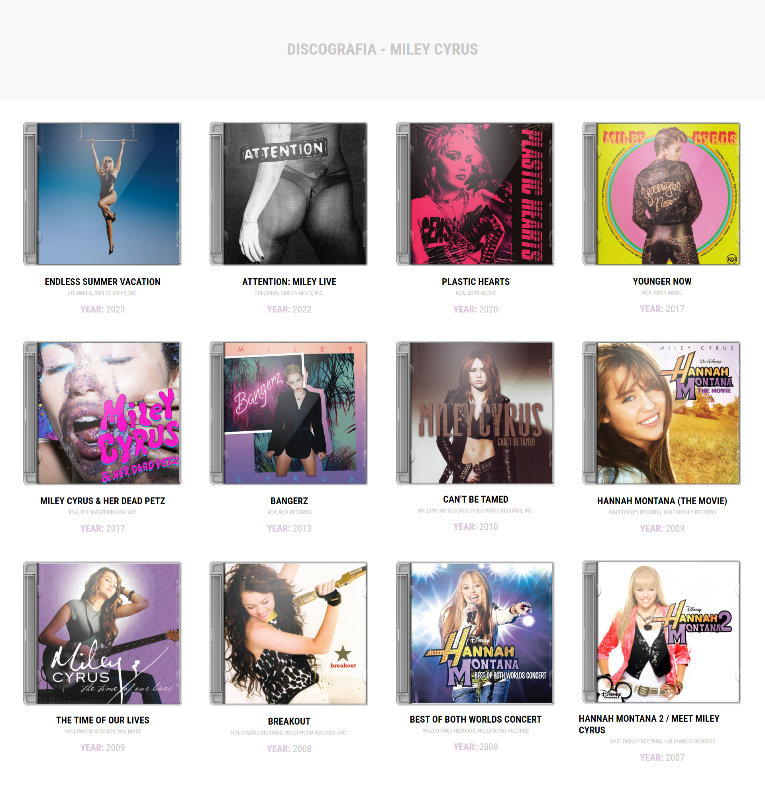

# Discografia - Miley Cyrus (Ainda em estágio inicial) 🎤

Repositório criado para estudos para exibir a discografia completa da cantora Miley Cyrus utilizando pela primeira vez a captura de dados por uma API externa do site [Discogs](https://www.discogs.com/). Utilizei recursos de sobreposição de imagem (a caixa de acrílico), mudanças ao passar o mouse no topo e nas imagens, além de deixar o site responsivo.

É possível visualizar o site online [clicando aqui](https://mcarolina.com.br/discografiaMileyCyrus/) 🖥️

### Utilizado:

- **HTML**
- **CSS**
- **Javascript**

### Repositório Criado por

- **Maria Carolina**
  - GitHub: [@wcarolc](https://github.com/wcarolc)
